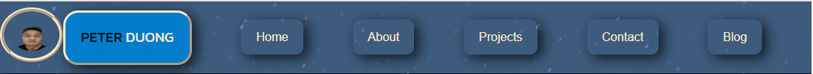

# T1A2 PeterDuong Assignment

## Links Required for README Document

### Link to Published Portfolio Website
[Netlify](https://peterduongt1a2.netlify.app/)

### Link to GitHub Repository 
[GitHub](https://github.com/peter-duongGHub?tab=repositories)

## Purpose
The purpose of my website is to showcase my skills, hobbies & work experience to prospective dev employers. It is to also show the commitment and passion I have towards pursuing a professional role as a full stack web developer or eventually becoming a back end developer. It is also to show the proficient amount of knowledge in HTML & CSS I have learnt in the past few weeks, although not perfect I soon hope to be and if not soon then eventually. One way or another.

## How components and styling will engage the audience
### Use of coolors colour kit
- With the synergy of certain colours mixed with coolors, the colour scheme for the website will be much more attractive and captivating to the viewing eye. The colours blue and yellow help contrast each other by complimentary color harmony as they are opposites on the color wheel. These colours envoke peaceful and joyful emotions.  
### Use of box shadows 
- The use of box shadows for containers holding text components in my websites helps attract attention to the area of concern for viewers to engage with.   
### Use of Animated Icons  
- Animated Icons were implemented to add a touch of interactivity with the user for a greater user experience. Although the user cannot physically interact with the icons, there is a visual interaction aspect.  
### Use of Horizontal Lines 
- The use of horizontal lines is added to help users distinguish different sections of the page and divide content.  
### Background Colors/Images  
- The use of background colours/images for text components helps with readability of text when used in conjunction with complimentary colours.  
### Use of line-height, font-size, word-spacing, font-family, letter-spacing 
- For readability purposes all the mentioned properties were set to the recommended sizes. This makes reading the document easier.
### Contact Page Form
- Contact Page is a form that can be filled by the visitor or viewer for any enquiries or employment opportunities for me
### Blog links listed or through read more button
- Blog Posts can be accessed by clicking the read more button or click the individual blog links. Each link will redirect the user to a specific blog post in which users may read about interesting topics relating to web development.

### Coolors 
 

## Wireframes
### Mobile Breakpoint Wireframes
[Wireframe of Mobile Breakpoint for Home](./doc/Mobile_Breakpoint/Mobile_Home.PNG)  
[Wireframe of Mobile Breakpoint for About](./doc/Mobile_Breakpoint/Mobile_About.PNG)  
[Wireframe of Mobile Breakpoint for Projects](./doc/Mobile_Breakpoint/Mobile_Projects.PNG)  
[Wireframe of Mobile Breakpoint for Contact](./doc/Mobile_Breakpoint/Mobile_Contact.PNG)  
[Wireframe of Mobile Breakpoint for Blog](./doc/Mobile_Breakpoint/Mobile_Blog.PNG)  
[Wireframe of Mobile Breakpoint for Blog Pages](./doc/Mobile_Breakpoint/Mobile_BlogPage.PNG)  

### Tablet Breakpoint Wireframes
[Wireframe of Tablet Breakpoint for Home](./doc/Tablet_Breakpoint/Tablet_Home.PNG)  
[Wireframe of Tablet Breakpoint for About](./doc/Tablet_Breakpoint/Tablet_About.PNG)  
[Wireframe of Tablet Breakpoint for Projects](./doc/Tablet_Breakpoint/Tablet_Projects.PNG)  
[Wireframe of Tablet Breakpoint for Contact](./doc/Tablet_Breakpoint/Tablet_Contact.PNG)  
[Wireframe of Tablet Breakpoint for Blog](./doc/Tablet_Breakpoint/Tablet_Blog.PNG)  
[Wireframe of Tablet Breakpoint for Blog Pages](./doc/Tablet_Breakpoint/Tablet_BlogPage.PNG)  

### Desktop Breakpoint Wireframes
[Wireframe of Desktop Breakpoint for Home](./doc/Desktop_Breakpoint/Desktop_Home.PNG)  
[Wireframe of Desktop Breakpoint for About](./doc/Desktop_Breakpoint/Desktop_About.PNG)  
[Wireframe of Desktop Breakpoint for Projects](./doc/Desktop_Breakpoint/Desktop_Projects.PNG)  
[Wireframe of Desktop Breakpoint for Contact](./doc/Desktop_Breakpoint/Desktop_Contact.PNG)  
[Wireframe of Desktop Breakpoint for Blog](./doc/Desktop_Breakpoint/Desktop_Blog.PNG)  
[Wireframe of Desktop Breakpoint for Blog Pages](./doc/Desktop_Breakpoint/Desktop_BlogPage.PNG)  
 

## Decision making process relating to aesthetic of my website
- **Structuring the design of my website**  
My decision making process relating to the aesthetic of my website revolved around the use of coolors
and wireframes. I first started with structuring the HTML skeleton using wireframes to design the layout of the website at different breakpoints. I used Coolors to select the colour scheme for the overall presentation of the website deciding on both the primary and secondary colours and any shades of the two.
- **BreakPoints**  
I decided on how my website would look at varying breakpoints. I began to style my website at width: 400px using the inspect component on google chrome browser at 100% zoom. I decided to have my website change its orientation and display at (min-width: 992px) for tablets and (min-width: 1200px) for desktops.
- **Breakpoints used**     
Mobile: min-width: 450px;  
Tablet: min-width: 992px;  
Desktop: min-width: 1200px;  

## Sitemap

### Page Features Mobile/Tablet Breakpoint
---

#### Home Page 
- Logo
- Header Navigation Bar
- Animated Icons
- Graphical Component
- Text Component
- Resume Mockup
- Footer Social Media Navigation Bar linking to external websites (GitHub, LinkedIn & Facebook)
- Copyright text  

#### About Page 
- Logo
- Header Navigation Bar
- Text Component(s)
- Heading
- Horizontal Line
- Graphical Component(s)
- Resume Mockup
- Footer Social Media Navigation Bar linking to external websites (GitHub, LinkedIn & Facebook)
- Copyright text

#### Projects Page 
- Logo
- Header Navigation Bar
- Graphical Component(s)
- Heading
- Resume Mockup
- Footer Social Media Navigation Bar linking to external websites (GitHub, LinkedIn & Facebook)
- Copyright text

#### Contact Page       
- Logo
- Header Navigation Bar
- Heading
- Text Component(s)
- Text input fields
- Submission button
- Resume Mockup
- Footer Social Media Navigation Bar linking to external websites (GitHub, LinkedIn & Facebook)
- Copyright text

#### Blog Page 
- Logo
- Header Navigation Bar
- Heading(s)
- 5 Navigation links to 5 different blog pages 
- Graphical/Text Components
- 5 Read more buttons linking to 5 respective blog pages
- Resume Mockup
- Footer Social Media Navigation Bar linking to external websites (GitHub, LinkedIn & Facebook)
- Copyright text

#### Blog Post Page 
- Logo
- Header Navigation Bar
- Heading
- Text including; date, author
- Text component
- Graphical component
- Resume Mockup
- Footer Social Media Navigation Bar linking to external websites (GitHub, LinkedIn & Facebook)
- Copyright text

### Page Functionality Mobile Breakpoint (min-width: 768px)
---

#### Header Navigation Links
The Home, About, Projects, Contact, Blog & Blog Post pages will have a horizontal navigation bar located at the top of the page linking to the main home page, about page, projects page, contact page & blog page. The above mentioned pages will also include a logo at the top of the page linking back to the default home page.  

#### Footer Navigation Links
The Home, About, Projects, Contact, Blog & Blog Post pages will have a footer navigation menu which will include;   
- **Social Media Navigation Links**   
These icons will link to their respective social media websites (E.g LinkedIn icon will link to LinkedIn.) via a seperate web page. When clicked these icons link to external social media websites (respectively) and will open a new web page.
- **Mockup Resume Button**  
Clicking this button will load a new web page with a mockup resume 
- **Contact Details**    
Contact details will include an address and email address to which viewers may send an email. When clicking the email address a default external web page should appear with pre-filled details for the recipient email address.
- **Copyright**    
Copyright details are listed at the bottom of the page to protect my original idea/work from unlicensed use.

### Page Functionality Tablet Breakpoint (min-width: 992px)
---

#### Header Navigation Links  
The Home, About, Projects, Contact, Blog & Blog Post pages will have a horizontal navigation bar located at the top of the page linking to the main home page, about page, projects page, contact page & blog page. The above mentioned pages will also include a logo at the top of the page linking back to the default home page.  

#### Footer Navigation Links
The Home, About, Projects, Contact, Blog & Blog Post pages will also have a footer navigation menu which will include;   
- **Social Media Navigation Links**   
These icons will link to their respective social media websites (E.g LinkedIn icon will link to LinkedIn.) via a seperate web page. When clicked these icons link to external social media websites (respectively) and will open a new web page.
- **Mockup Resume Button**  
Clicking this button will load a new web page with a mockup resume 
- **Contact Details**    
Contact details will include an address and email address to which viewers may send an email. When clicking the email address a default external web page should appear with pre-filled details for the recipient email address.
- **Copyright**    
Copyright details are listed at the bottom of the page to protect my original idea/work from unlicensed use.

### Page Features Desktop Breakpoint (min-width: 1200px)
---

#### Home Page
- Logo
- Side Navigation Bar includes; Home page, About page, Projects, page, 
Contact page, Blog page, Social media icons (link to external website; GitHub, LinkedIn & Facebook) & Resume Mockup
- Graphical Component
- Heading(s)
- Text Component

#### About Page    
- Logo
- Side Navigation Bar includes; Home page, About page, Projects, page, 
Contact page, Blog page, Social media icons (link to external website; GitHub, LinkedIn & Facebook) & Resume Mockup
- Text Component(s)
- Graphical Component(s)
- Animated Icon
- Heading(s)

#### Projects Page 
- Logo
- Side Navigation Bar includes; Home page, About page, Projects, page, 
Contact page, Blog page, Social media icons (link to external website; GitHub, LinkedIn & Facebook) & Resume Mockup
- Graphical Component(s)
- Heading(s)
- Text Component(s)

#### Contact Page       
- Logo
- Side Navigation Bar includes; Home page, About page, Projects, page, 
Contact page, Blog page, Social media icons (link to external website; GitHub, LinkedIn & Facebook) & Resume Mockup
- Heading
- Text Component(s)
- Text input fields
- Submission button

#### Blog Page 
- Logo
- Side Navigation Bar includes; Home page, About page, Projects, page, 
Contact page, Blog page, Social media icons (link to external website; GitHub, LinkedIn & Facebook) & Resume Mockup
- Heading(s)
- 5 Navigation links to 5 different blog pages 
- Graphical/Text Components
- 5 Read more buttons linking to 5 respective blog pages
Viewers

#### Blog Post Page 
- Logo
- Side Navigation Bar includes; Home page, About page, Projects, page, 
Contact page, Blog page, Social media icons (link to external website; GitHub, LinkedIn & Facebook) & Resume Mockup
- Heading
- Text including; date, author
- Text component
- Graphical component

### Page Functionality Desktop Breakpoint (min-width: 1200px)
---

#### Side Navigation Links  
The Home, About, Projects, Contact, Blog & Blog Post pages will have a side navigation menu which will include;   
- **Social Media Navigation Links**     
These icons will link to their respective social media websites (E.g LinkedIn icon will link to LinkedIn.) via a seperate web page. When clicked these icons link to external social media websites (respectively) and will open a new web page.
- **Mockup Resume Button**  
Clicking this button will load a new web page with a mockup resume 
- **Page Navigation Links**  
These links when clicked will direct the viewer to the appropriate page that has been clicked. (E.g if Home is clicked user will be taken to the Home Page.)
- **Logo**  
When the logo is clicked the viewer/user will be returned to the default home page.

## Target Audience 
- IT/Tech Employers
- Potential dev employers looking to hire a passionate skilled web developer
- For employers looking to onboard a trained web developer with ongoing passion for growth and learning

## Tech Stack
- GitHub as Remote repository
- Netlify as Deployment platform
- VisualStudio Code (VSCode) for source code editing
- HTML for Structural Design of Website (no styling)
- CSS for Styling Design of Website
- Figma for Wireframes
- Draw.io for Sitemap
- Social Media Icons and Animated Icons Imported from FontAwesome
- Images used in Rendered Browser downloaded from unsplash 
- Coolors for designing website colour scheme